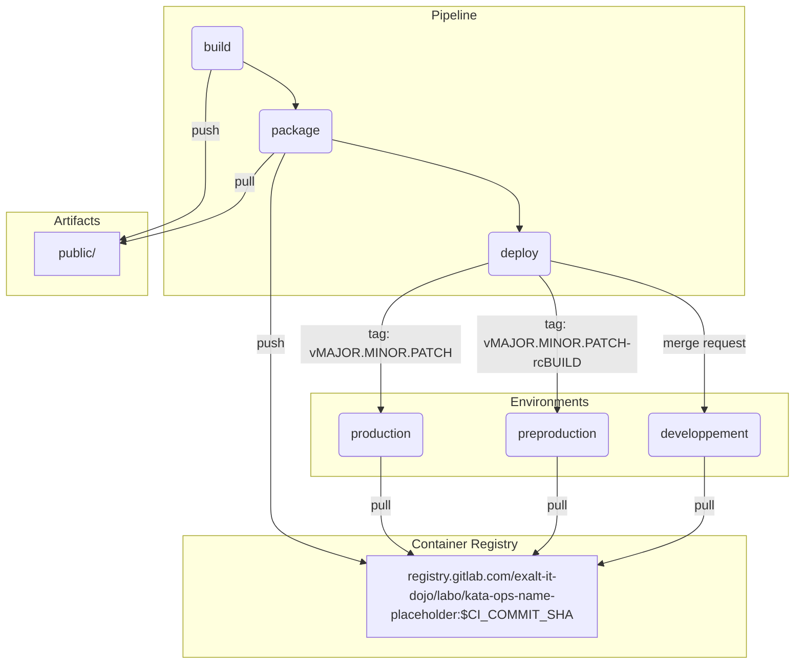
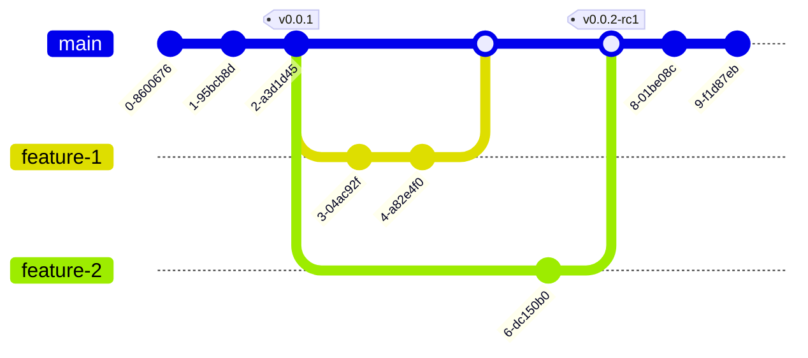

# 🐈 **Cat's blog** 🐈‍⬛

# Sujet

Ce kata est un challenge d'automatisation de la livraison et du deploiement d'un site statique hébergé en local au travers d'une instance de conteneur Nginx.

Forkez le projet 

## Mise en place de la landing zone locale
### Etape 1 - Installation des dépendances
___
- [Docker](https://docs.docker.com/get-docker/) 
- [GitLab Runner](https://docs.gitlab.com/runner/install/)

Sur Windows modifiez `config.toml` pour utiliser le bon shell. 

### Etape 2 - Paramétrage des runners
___
- Enregistrez 2 runners : 

    1. un runner avec executor **docker**, portant un tag `build-runner`
    2. un runner avec executor **shell**,  portant un tag `deploy-runner`

- Désactivez :

    1. Shared runners
    2. Run untagged jobs

### Etape 3 - Mise en place de la CI
___
- Gitflow : une branche principale et des branches de features
- 3 stages (see : [gitlab-ci](./.gitlab-ci.yml))

    1. build   : se déclanche partout à l'exeption de `merge request` et `tag`. Génère le contenu statique et le stocke comme artefact. 
    2. package : se déclanche partout à l'exeption de `merge request` et `tag`. Télécharge l'artefact et le met dans une image Nginx.
    3. deploy  : uniquement dans un context de `merge request` ou `tag` respectant la sémantique de version [SemVer 2.0.0](https://semver.org/lang/fr/spec/v2.0.0.html), déploie le site en environnement de **développement** si contexte de `merge request` et en environnement de **preproduction** ou **production** si contexte `tag`.
- Comportement attendu du CI

# Objectif & contexte:

Gitlab est une plateforme qui permet de gérer le cycle de vie complet d'un projet logiciel, de la planification à la livraison en passant par le développement, les tests et le déploiement. Il permet de mettre en place les best practice DevOps, comme le contrôle de version, la collaboration, la conformité et le CI/CD, pour automatiser les processus et accélérer la livraison de valeur. Maitriser les bases de ce type de plateforme est donc primordiale.

Voici les objectifs de ce kata : 
- Configurer des runners gitlab
- Rajouter un tag à un runner
- Utiliser un `Container Registery`, `Artifact` et `Gitlab Environments`
- Revoir les différents moyens pour déclencher un pipeline.
- Utiliser les rules de Gitlab CI
- Builder une image `Docker` via Kaniko

# Specification [RFC2119](https://microformats.org/wiki/rfc-2119-fr) du kata

**1. Utilisation de runners pour exécuter les jobs**
 * Le projet `ne doit pas` utiliser les runners partagés de gitlab
 * Un runner `peut` être enregistré sur n'importe quel OS (Windows, Mac Os, Linux) et sur n'importe quelle plateforme (local, Cloud)
 * L'excutor de **deploy-runner** `peut` être **Kubernetes** pour ceux qui le maîtrisent 

**2. Implémentation de la CI**
 * Le contenu du fichier [gitlab-ci](./.gitlab-ci.yml) `doit` être modifié tout en préservant les valeurs déjà présentes
 * Il est recommandé de rajouter d'autres [Job keywords](https://docs.gitlab.com/ee/ci/yaml/#job-keywords) au fichier [gitlab-ci](./.gitlab-ci.yml)
 * Les job **deploy** `doit` se lancer uniquement dans un contexte de **tag** [semver](https://semver.org/lang/fr) ou de **merge request**
 * Il est `recommandé` de déployer le conteneur **ngnix** sur la même machine qui fait tourner le runner **deploy-runner**

**3. Modalité de rendu**
* Une fois que la CI est considéré par le candidat comme étant fonctionnelle, il `doit` le tagguer avec la version **0.0.1**
* Il `doit` ensuite créer 2 branches nommées : 
    - *feature-1* : pour le rajout de contenu dans [about](./content/about/_index.md) ensuite mettre **draft** à false 
    - *feature-2* : pour le rajout de contenu dans [caring](./content/caring/_index.md) ensuite mettre **draft** à false
* Mergez les deux branche et `doit` tagguer avec la version **0.0.2-rc1**

**4. Bonus**
* Le candidat `peut` déployer ses runners et conteneurs sur le Cloud de son choix en utilisant ansible comme outil de provisionning
* Le candidat `peut` créer des environnements par feature qui se créent à l'ouverture d'une merge request et qui se détruisent automatiquement après une semaine d'inactivités. Dans ce cas là :
    - **ENVIRONMENT: "developpement"** `devrait` être remplacé par **ENVIRONMENT: review-$CI_MERGE_REQUEST_IID**
    - **CONTAINER_NAME: blog-dev** `devrait` être remplacé par **CONTAINER_NAME: blog-dev-$CI_MERGE_REQUEST_IID**
