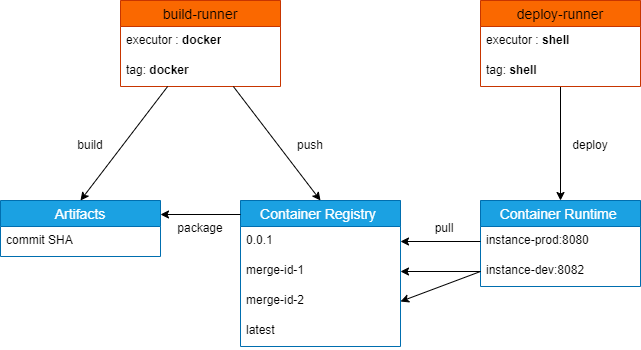
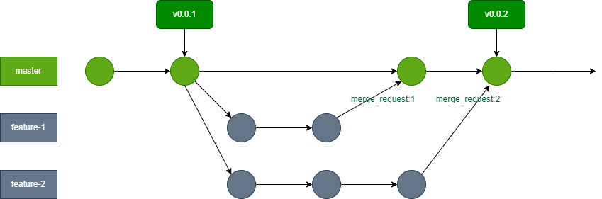

# 🐈 **Cat's blog** 🐈‍⬛

# Sujet

Ce kata est un challenge d'automatisation de la livraison et du deploiement d'un site statique hébergé sur un server Nginx.

### Etape 1 - Installations
___
- [Docker](https://docs.docker.com/get-docker/) 
- [GitLab Runner](https://docs.gitlab.com/runner/install/)

N'hésitez pas à modifier le fichier `config.toml`. 

### Etape 2 - Configuration
___
- Forkez le projet 
- Enregistrez 2 runners : 

    1. build-runner  : un runner avec executor **docker**, portant un tag `docker`
    2. deploy-runner : un runner avec executor **shell**, portant un tag `shell`

    
    Schema 1 : Rôles par runner 

- Désactivez :

    1. Shared runners
    2. Run untagged jobs

### Etape 3 - Mise en place de la CI
___
- Gitflow : une branche principale et des branches de features (pas de branch dev)
    
    Schema 2 : Gitflow
- 3 stages (see : [gitlab-ci](./.gitlab-ci.yml))

    1. build   : se déclenche uniquement sur une `branche`, génère le contenu statique et le stocke comme artefact pour une durée défini. ⚠️ Le repertoire themes contient des sous-modules, trouvez comment les résoudres dans la CI, et pensez à le mettre en cache.
    2. package : uniquement dans un context de `merge request` ou `tag` respectant la sémantique de version [semver](https://semver.org/lang/fr), télécharge l'artefact et le met dans une image Nginx.
    3. deploy  : uniquement dans un context de `merge request` ou `tag` respectant la sémantique de version [semver](https://semver.org/lang/fr), déploie le site en environnement de **développement** si contexte à `merge request` et en environnement de **production** si contexte `tag`.

# Objectif & contexte:

Gitlab est une plateforme qui permet de gérer le cycle de vie complet d'un projet logiciel, de la planification à la livraison en passant par le développement, le test et le déploiement. Il permet de mettre en place les best practice DevOps, comme le contrôle de version, la collaboration, la conformité et le CI/CD, pour automatiser les processus et accélérer la livraison de valeur. Maitriser les bases de ce type de plateforme est donc primordiale.

Voici les objectifs de ce kata : 
- Configurer des runners gitlab
- Rajouter un tag à un runner
- Utiliser un `Container Registery` et `Artifact` 
- Exploiter l'API de Gitlab via un `Access Token`
- Revoir les différents moyens pour déclencher un pipeline.
- Utiliser le rule `workflow` de Gitlab CI
- Builder de manière dynamique une image `Docker`

# Specification [RFC2119](https://microformats.org/wiki/rfc-2119-fr) du kata

**1. Utilisation de runners pour exécuter les jobs**
 * Le projet `ne doit pas` utiliser les runners partagés de gitlab
 * Un runner `peut` être enregistré sur n'importe quel OS (Windows, Mac Os, Linux) et sur n'importe quelle plateforme (local, Cloud)
 * L'excutor de **deploy-runner** `peut` être **Kubernetes** pour ceux qui le maîtrisent 

**2. Implémentation de la CI**
 * Le contenu du fichier [gitlab-ci](./.gitlab-ci.yml) `doit` être modifié tout en préservant les valeurs déjà présentes à l'exception du [Job keywords](https://docs.gitlab.com/ee/ci/yaml/#job-keywords) *script*
 * Il est recommandé de rajouter d'autres [Job keywords](https://docs.gitlab.com/ee/ci/yaml/#job-keywords) au fichier [gitlab-ci](./.gitlab-ci.yml)
 * Les job **package** et **deploy** `doit` se lancer uniquement dans un contexte de **tag** [semver](https://semver.org/lang/fr) ou de **merge request**
 * Il est `recommandé` de déployer le conteneur **ngnix** sur la même machine qui fait tourner le runner **deploy-runner**

**3. Modalité de rendu**
* Une fois que la CI est considéré par le candidat comme étant fonctionnelle, il `doit` le tagguer avec la version **0.0.1**
* Il `doit` ensuite créer 2 branches nommées : 
    - *feature-1* : pour le rajout de contenu dans [about](./content/about/_index.md) ensuite mettre **draft** à false 
    - *feature-2* : pour le rajout de contenu dans [caring](./content/caring/_index.md) ensuite mettre **draft** à false 
* `Doit` finalment présenter un graphe similaire au [schéma 2](./gitflow.png)